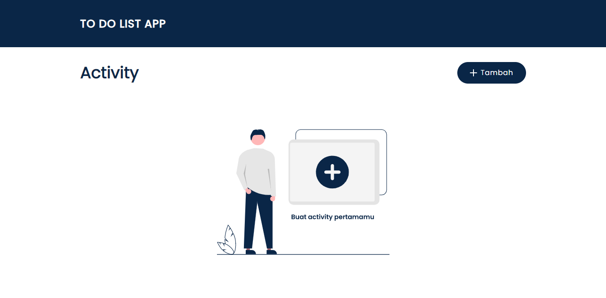

# Noted

[](https://noted-todo-app.netlify.app/)

## Developing

Node.js `>= 16.x` setup with [yarn](https://yarnpkg.com/) is recommended.

```bash
# duplicate & fill environment file
cp .env.example

# install dependencies
yarn

# serve with hot reload at localhost:3000
yarn start

# build for production
yarn build
```

## Built with

- Framework - [**ReactJS**](https://reactjs.org/)
- Build Tool - [**Vite**](https://vitejs.dev/)
- Statically Typed - [**Typescript**](https://www.typescriptlang.org/)
- Styling - [**ChakraUI**](https://chakra-ui.com/)
- Fonts - [**FontSource**](https://fontsource.org/)
- Icons - [**ReactIcons**](https://react-icons.github.io/react-icons/)
- Data Fetching - [**Axios**](https://axios-http.com/)
- Cliend Side Routing - [**ReactRouterDOM**](https://reactrouter.com/)
- Package Manager - [**Yarn**](https://yarnpkg.com/)
- Linter - [**Eslint**](https://eslint.org/)
- Code Formatter - [**Prettier**](https://prettier.io/)
- Deploy - [**Netlify**](https://www.netlify.com/)
